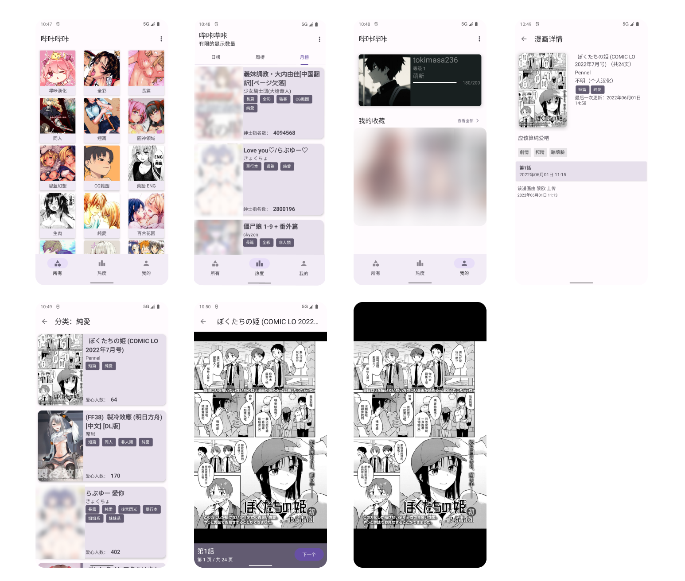

# PicacgMaterial3
 picacomic 第三方带有Material3主题的Android App

 ## 特性
 
 纯净
 
 本人学艺不精，按照道理而言只要网络通畅就很好，但是由于Pica的网络请求不知道为什么这么大，中午就出现超时情况。虽然我对于网络请求都进行了错误抛出并加入了重试按钮，但这不一定有用。所以我建议大家随缘看，能看就看，一直重试失败就算了，而且看多也不好。

 对于看漫画图片链接获取失败：由于有的漫画页数很多，所以获取的很慢，而且一旦失败一次就会提示重新加载。我的建议是网络好的时候再看，或者更换**分流**。

 **最后建议大家还是去使用Pica官方软件。多支持官方**

## 截屏

## 鸣谢

[tachiyomi-extensions/picacomic](https://github.com/tachiyomiorg/tachiyomi-extensions/tree/master/src/zh/picacomic) 代码提供大量帮助，非常感谢

[Ankikong/picacomic](https://github.com/AnkiKong/picacomic) Api支持

[czp3009/picacomic-api](https://github.com/czp3009/picacomic-api) api支持

还有其他大大小小的开源项目，让我这个初学者得以做出此软件

## 反馈
有bug就提issue，我会尽量解决

## License

MIT License

Copyright (c) 2022 shizheng233

Permission is hereby granted, free of charge, to any person obtaining a copy
of this software and associated documentation files (the "Software"), to deal
in the Software without restriction, including without limitation the rights
to use, copy, modify, merge, publish, distribute, sublicense, and/or sell
copies of the Software, and to permit persons to whom the Software is
furnished to do so, subject to the following conditions:

The above copyright notice and this permission notice shall be included in all
copies or substantial portions of the Software.

THE SOFTWARE IS PROVIDED "AS IS", WITHOUT WARRANTY OF ANY KIND, EXPRESS OR
IMPLIED, INCLUDING BUT NOT LIMITED TO THE WARRANTIES OF MERCHANTABILITY,
FITNESS FOR A PARTICULAR PURPOSE AND NONINFRINGEMENT. IN NO EVENT SHALL THE
AUTHORS OR COPYRIGHT HOLDERS BE LIABLE FOR ANY CLAIM, DAMAGES OR OTHER
LIABILITY, WHETHER IN AN ACTION OF CONTRACT, TORT OR OTHERWISE, ARISING FROM,
OUT OF OR IN CONNECTION WITH THE SOFTWARE OR THE USE OR OTHER DEALINGS IN THE
SOFTWARE.

*本软件按“原样”提供，不提供任何形式的明示或暗示保证，包括但不限于适销性、特定用途适用性和非侵权保证。 在任何情况下，作者或版权所有者均不对任何索赔、损害或其他责任负责，无论是在合同、侵权或其他方面，由以下原因引起：
与软件或软件的使用或其他交易无关或与之相关。*